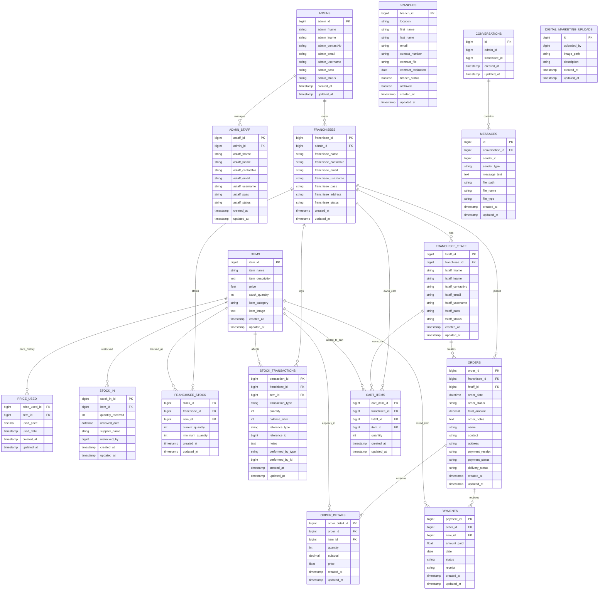

# Database ERD

This document summarizes the current database structure based on the Laravel migrations in `database/migrations`.

## Main ERD

## Explanation of the Design

### 1. User and account management

- `admins` is the top-level account table.
- `admin_staff` stores staff members working under a specific admin.
- `franchisees` represents each franchise owner or client account and each franchisee belongs to one admin.
- `franchisee_staff` stores staff accounts under a franchisee.

This creates a hierarchy:

`Admin -> Admin Staff`

`Admin -> Franchisees -> Franchisee Staff`

### 2. Product and inventory management

- `items` is the master product table.
- `price_used` keeps a history of item prices over time.
- `stock_in` records replenishment events for items.
- `franchisee_stock` tracks how much of each item is currently assigned to a franchisee.
- `stock_transactions` provides a movement log for stock changes such as stock coming in, stock going out, or manual adjustments.

In short, `items` is the center of inventory, while the other tables describe price history, replenishment, per-franchise stock levels, and audit history.

### 3. Ordering and sales flow

- `orders` is the header table for each order.
- One order can belong directly to a `franchisee` or be created by a `franchisee_staff` account.
- `order_details` stores the line items of the order.
- `payments` stores payment records tied to the order, with an optional link to a specific item.
- `cart_items` acts as a temporary shopping cart before an order is finalized.

This is the transaction flow:

`Cart Items -> Orders -> Order Details -> Payments`

### 4. Operational extensions

- `branches` stores branch information and contract status.
- `conversations` stores chat threads between admins and franchisees.
- `messages` stores individual messages inside a conversation.
- `digital_marketing_uploads` stores uploaded media used for digital marketing content.

These tables support operations outside the core order and inventory flow.

## Relationship Summary

- One `admin` can have many `admin_staff`.
- One `admin` can have many `franchisees`.
- One `franchisee` can have many `franchisee_staff`.
- One `franchisee` can have many `orders`.
- One `franchisee_staff` can have many `orders`.
- One `order` can have many `order_details`.
- One `item` can appear in many `order_details`.
- One `order` can have many `payments`.
- One `item` can have many `price_used` records.
- One `item` can have many `stock_in` records.
- One `franchisee` can have many `franchisee_stock` records.
- One `item` can have many `franchisee_stock` records.
- One `franchisee` can have many `stock_transactions`.
- One `item` can have many `stock_transactions`.
- One `conversation` can have many `messages`.

## Important Notes About the Current Schema

- `conversations.admin_id` and `conversations.franchisee_id` are stored as IDs, but the migration does not define foreign key constraints for them.
- `digital_marketing_uploads.uploaded_by` is stored as a numeric ID, but there is no foreign key constraint showing whether it belongs to an admin, staff, or another user type.
- `stock_in.restocked_by` is also stored as a numeric ID without a strict foreign key, which suggests a polymorphic or application-level reference.
- `messages.sender_id` and `messages.sender_type` form a polymorphic-style relationship, but it is not enforced by database foreign keys.
- `orders` contains both `order_status` and the later-added `payment_status` and `delivery_status`, so status handling is split across multiple columns.
- `payments.item_id` is nullable, which means some payments are recorded at the order level rather than for one specific item.

## Suggested Presentation Script

If you need to explain this ERD in class or documentation, you can use this short version:

"The database is centered on four major modules: user management, inventory, ordering, and operations. Admins manage franchisees and admin staff. Franchisees can also have their own staff. Items are the core inventory entity, connected to price history, stock-in records, franchise stock, and stock transaction logs. The sales process starts from cart items, then moves into orders, order details, and payments. Additional tables such as branches, conversations, messages, and digital marketing uploads support the wider business workflow."
