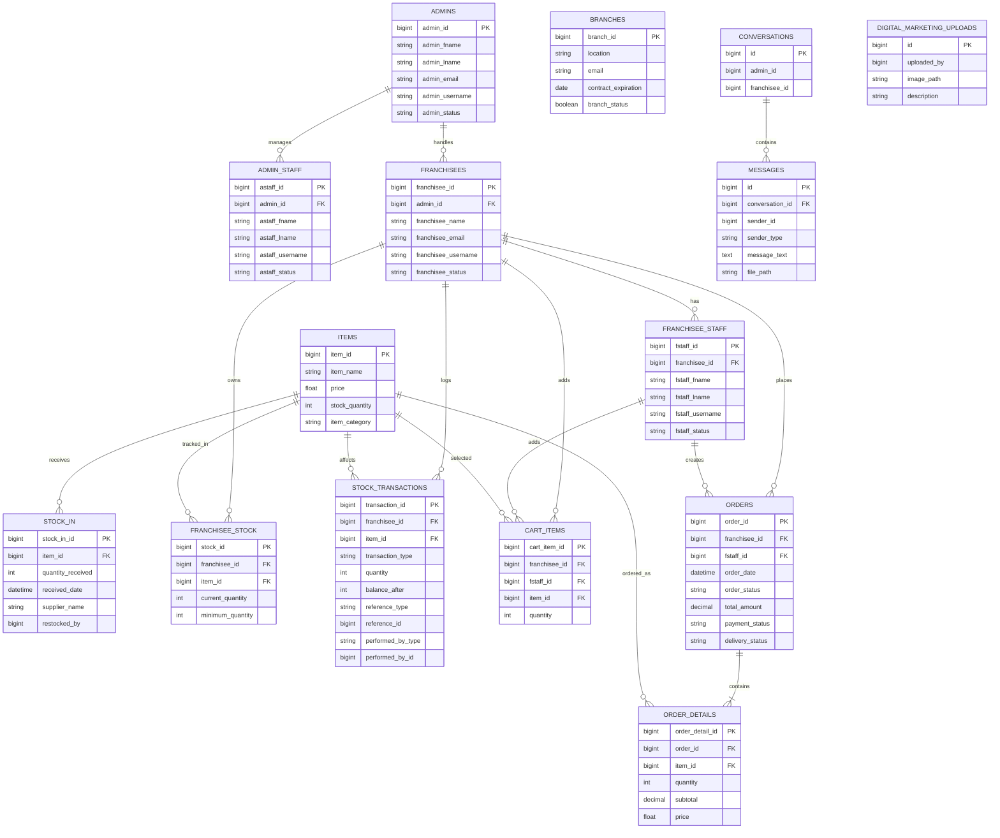

# Database ERD

This document presents the Entity Relationship Diagram of the tables that are actively used by the current application code. Tables that exist in migrations but are not used in the working system flow were intentionally excluded.

## Included Tables

The ERD below includes only the tables that are actively used in controllers, routes, views, services, or reports:

- `admins`
- `admin_staff`
- `franchisees`
- `franchisee_staff`
- `items`
- `stock_in`
- `franchisee_stock`
- `stock_transactions`
- `cart_items`
- `orders`
- `order_details`
- `branches`
- `conversations`
- `messages`
- `digital_marketing_uploads`

## Excluded Tables

The following tables were not included in this ERD because they are not part of the active application flow:

- `price_used`
- `payments`

Reason:

- `price_used` exists in migrations, but there is no active model, controller, route, report, or view logic using it.
- `payments` also exists in migrations, but the current application handles payment proof and payment status directly in the `orders` table using fields such as `payment_receipt` and `payment_status`.

## ERD Illustration

## Textual ERD Explanation

### 1. Admins

The `admins` table stores the main franchisor or administrator accounts of the system.

- Primary Key: `admin_id`
- One admin can have many `admin_staff`
- One admin can have many `franchisees`

### 2. Admin Staff

The `admin_staff` table stores staff members working under the admin.

- Primary Key: `astaff_id`
- Foreign Key: `admin_id` references `admins.admin_id`
- Many admin staff records can belong to one admin

### 3. Franchisees

The `franchisees` table stores franchisee accounts and business information.

- Primary Key: `franchisee_id`
- Foreign Key: `admin_id` references `admins.admin_id`
- One franchisee can have many `franchisee_staff`
- One franchisee can have many `orders`
- One franchisee can have many `franchisee_stock` records
- One franchisee can have many `stock_transactions`
- One franchisee can have many `cart_items`

### 4. Franchisee Staff

The `franchisee_staff` table stores staff members under each franchisee.

- Primary Key: `fstaff_id`
- Foreign Key: `franchisee_id` references `franchisees.franchisee_id`
- One franchisee can have many franchisee staff members
- One staff member can create many orders
- One staff member can own many cart items

### 5. Items

The `items` table stores the product master list.

- Primary Key: `item_id`
- One item can have many `stock_in` records
- One item can appear in many `franchisee_stock` records
- One item can appear in many `stock_transactions`
- One item can appear in many `cart_items`
- One item can appear in many `order_details`

### 6. Stock In

The `stock_in` table records inventory replenishment.

- Primary Key: `stock_in_id`
- Foreign Key: `item_id` references `items.item_id`
- Many stock-in records can belong to one item

The `restocked_by` field is used by the system, but it is not enforced as a strict foreign key in the database.

### 7. Franchisee Stock

The `franchisee_stock` table stores current stock levels of items assigned to franchisees.

- Primary Key: `stock_id`
- Foreign Key: `franchisee_id` references `franchisees.franchisee_id`
- Foreign Key: `item_id` references `items.item_id`

This table links franchisees and items for per-branch inventory tracking.

### 8. Stock Transactions

The `stock_transactions` table records stock movement history.

- Primary Key: `transaction_id`
- Foreign Key: `franchisee_id` references `franchisees.franchisee_id`
- Foreign Key: `item_id` references `items.item_id`

This table is used for inventory adjustments, delivery merges, reporting, and branch inventory analytics.

### 9. Cart Items

The `cart_items` table stores temporary items before checkout.

- Primary Key: `cart_item_id`
- Foreign Key: `franchisee_id` references `franchisees.franchisee_id`
- Foreign Key: `fstaff_id` references `franchisee_staff.fstaff_id`
- Foreign Key: `item_id` references `items.item_id`

This table supports the cart flow before order creation.

### 10. Orders

The `orders` table stores the main order transaction.

- Primary Key: `order_id`
- Foreign Key: `franchisee_id` references `franchisees.franchisee_id`
- Foreign Key: `fstaff_id` references `franchisee_staff.fstaff_id`

The current system also stores payment-related information directly in this table through:

- `payment_receipt`
- `payment_status`
- `delivery_status`

### 11. Order Details

The `order_details` table stores the line items of each order.

- Primary Key: `order_detail_id`
- Foreign Key: `order_id` references `orders.order_id`
- Foreign Key: `item_id` references `items.item_id`

This resolves the many-to-many relationship between orders and items.

### 12. Branches

The `branches` table stores branch profile and contract information.

- Primary Key: `branch_id`

This table is used by branch management and branch contract reminder features. It is operationally related to franchisees through application logic, although there is no direct foreign key in the schema.

### 13. Conversations

The `conversations` table stores communication threads between admins and franchisees.

- Primary Key: `id`
- Related fields: `admin_id`, `franchisee_id`

These IDs are used by the application, but they are not defined as strict foreign keys in the migration.

### 14. Messages

The `messages` table stores the individual messages inside each conversation.

- Primary Key: `id`
- Foreign Key: `conversation_id` references `conversations.id`
- Related fields: `sender_id`, `sender_type`

The sender relationship is polymorphic in behavior and handled mainly at the application level.

### 15. Digital Marketing Uploads

The `digital_marketing_uploads` table stores uploaded marketing materials displayed in the franchisee dashboard.

- Primary Key: `id`
- Related field: `uploaded_by`

The uploader is stored as an ID, but it is not enforced by a database foreign key.

## Relationship Summary

- One `admin` can have many `admin_staff`.
- One `admin` can have many `franchisees`.
- One `franchisee` can have many `franchisee_staff`.
- One `franchisee` can have many `orders`.
- One `franchisee_staff` can create many `orders`.
- One `order` can have many `order_details`.
- One `item` can appear in many `order_details`.
- One `item` can have many `stock_in` records.
- One `franchisee` can have many `franchisee_stock` records.
- One `item` can have many `franchisee_stock` records.
- One `franchisee` can have many `stock_transactions`.
- One `item` can have many `stock_transactions`.
- One `franchisee` can have many `cart_items`.
- One `franchisee_staff` can have many `cart_items`.
- One `item` can have many `cart_items`.
- One `conversation` can have many `messages`.

## Short Documentation Narrative

The entity relationship design of the system is focused on account management, stock monitoring, ordering, and communication. The `admins` table is the main parent entity for both `admin_staff` and `franchisees`. Each franchisee can have multiple staff members through the `franchisee_staff` table. The `items` table serves as the core inventory entity and is connected to `stock_in`, `franchisee_stock`, `stock_transactions`, `cart_items`, and `order_details`. The order process flows from `cart_items` to `orders` and then to `order_details`, while payment tracking is currently handled directly inside the `orders` table. Additional operational support is provided by `branches`, `conversations`, `messages`, and `digital_marketing_uploads`.

## Final Corrected ERD Checklist

Use this checklist when revising your ERD image.

### Keep These Tables

- `admins`
- `admin_staff`
- `franchisees`
- `franchisee_staff`
- `items`
- `stock_in`
- `franchisee_stock`
- `stock_transactions`
- `cart_items`
- `orders`
- `order_details`
- `branches`
- `conversations`
- `messages`
- `digital_marketing_uploads`

### Remove These Tables

- `payments`
- `price_used`

### Fix These Field Names

- In `admin_staff`, remove `staffAdmin_id`. The correct foreign key is `admin_id`.
- In `admin_staff`, include `astaff_email` if you want the ERD to match the current schema.
- In `franchisee_staff`, include `fstaff_email` if you want the ERD to match the current schema.

### Use Solid Lines For Real Foreign Keys

- `admins.admin_id -> admin_staff.admin_id`
- `admins.admin_id -> franchisees.admin_id`
- `franchisees.franchisee_id -> franchisee_staff.franchisee_id`
- `items.item_id -> stock_in.item_id`
- `franchisees.franchisee_id -> franchisee_stock.franchisee_id`
- `items.item_id -> franchisee_stock.item_id`
- `franchisees.franchisee_id -> stock_transactions.franchisee_id`
- `items.item_id -> stock_transactions.item_id`
- `franchisees.franchisee_id -> cart_items.franchisee_id`
- `franchisee_staff.fstaff_id -> cart_items.fstaff_id`
- `items.item_id -> cart_items.item_id`
- `franchisees.franchisee_id -> orders.franchisee_id`
- `franchisee_staff.fstaff_id -> orders.fstaff_id`
- `orders.order_id -> order_details.order_id`
- `items.item_id -> order_details.item_id`
- `conversations.id -> messages.conversation_id`

### Use Dashed Lines Or Notes For Logical References Only

- `conversations.admin_id -> admins.admin_id`
- `conversations.franchisee_id -> franchisees.franchisee_id`
- `messages.sender_id` with `messages.sender_type`
- `stock_in.restocked_by`
- `digital_marketing_uploads.uploaded_by`
- any relationship from `branches` to another table

### Best Layout For The Diagram

Arrange the diagram by module so it becomes easier to read:

1. Accounts at the top:
   `admins`, `admin_staff`, `franchisees`, `franchisee_staff`

2. Inventory on the left or center:
   `items`, `stock_in`, `franchisee_stock`, `stock_transactions`

3. Orders on the right or center:
   `cart_items`, `orders`, `order_details`

4. Support tables at the bottom:
   `branches`, `conversations`, `messages`, `digital_marketing_uploads`

### Safe Final Rule

If your teacher or panel expects a strict database ERD, only draw lines for actual foreign keys defined in the migrations.

If they allow a system-level ERD, you may include `branches`, `uploaded_by`, `sender_id`, and conversation user links, but label them as application-level or logical relationships rather than strict database foreign keys.
